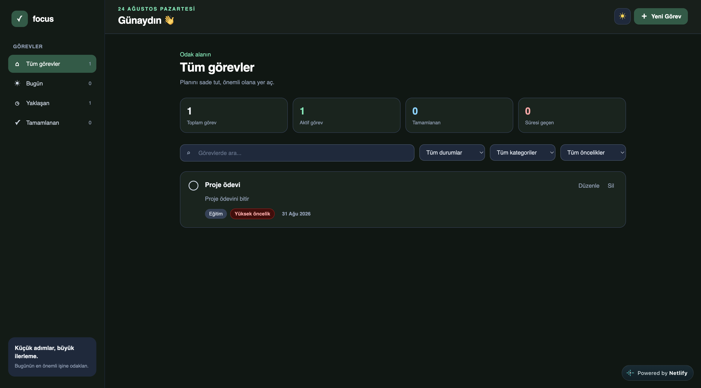
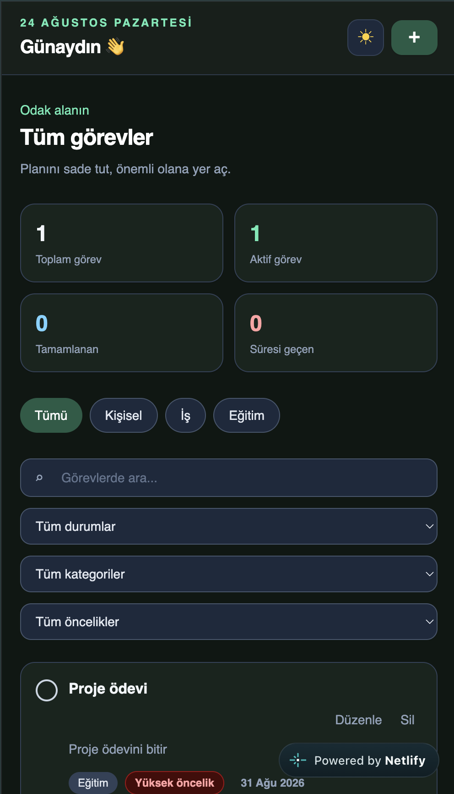

# Focus Todo

A responsive task management dashboard built with React and Tailwind CSS.

React ve Tailwind CSS ile geliştirilmiş responsive görev yönetimi uygulaması.

🔗 **Live Demo / Canlı Demo:** https://lucent-licorice-2daf55.netlify.app/

---

## Screenshots / Ekran Görüntüleri

<p align="center">
  
  
</p>

---

# English

## About the Project

Focus Todo is a responsive task management dashboard for organizing work, personal, and education tasks. It runs entirely in the browser and stores tasks and theme preferences on the current device.

## Features

* Create, edit, complete, and delete tasks
* Search tasks by title and description
* Combine status, category, and priority filters
* Sort active and completed tasks by due date
* Highlight overdue, due-today, and upcoming tasks
* Store tasks and theme preferences with LocalStorage
* Light and dark themes with system-theme detection
* Responsive statistics and task views
* Accessible modal, form validation, controls, and status announcements
* Mobile and desktop support

## Technologies

* React 19
* JavaScript
* JSX
* Vite 8
* Tailwind CSS 4
* ESLint
* Web Storage API (LocalStorage)
* Netlify

## Local Setup

### Requirements

* A current Node.js release
* npm

Clone the repository:

```bash
git clone https://github.com/MYusufKoca/focus-todo.git
cd focus-todo
```

Install the dependencies:

```bash
npm install
```

Start the development server:

```bash
npm run dev
```

## Available Commands

Run ESLint:

```bash
npm run lint
```

Create a production build:

```bash
npm run build
```

Preview the production build locally:

```bash
npm run preview
```

## Project Structure

```text
src/
├── components/   Reusable layout, task, and UI components
├── constants/    Shared task options
├── hooks/        LocalStorage state hook
├── utils/        Date, filtering, and sorting helpers
├── App.jsx       Application state and behavior
├── main.jsx      React entry point
└── index.css     Tailwind setup and global styles
```

## LocalStorage Keys

* `focus-todo-tasks`: Stores task records
* `focus-todo-theme`: Stores the `light` or `dark` theme preference

Data is stored in the current browser. Tasks are not synchronized between different browsers or devices.

## Deployment

The project is deployed on Netlify with the following settings:

```text
Build command: npm run build
Publish directory: dist
```

[Open the live application](https://lucent-licorice-2daf55.netlify.app/)

---

# Türkçe

## Proje Hakkında

Focus Todo; iş, kişisel ve eğitim görevlerini düzenlemek için geliştirilmiş responsive bir görev yönetimi uygulamasıdır. Uygulama tamamen tarayıcıda çalışır ve görevlerle tema tercihini kullanılan cihazda saklar.

## Özellikler

* Görev oluşturma, düzenleme, tamamlama ve silme
* Başlık ve açıklamaya göre görev arama
* Durum, kategori ve öncelik filtrelerini birlikte kullanma
* Aktif ve tamamlanmış görevleri son tarihe göre sıralama
* Süresi geçen, bugün bitecek ve yaklaşan görevleri gösterme
* LocalStorage ile görev ve tema tercihini saklama
* Sistem temasını algılayan açık ve koyu tema
* Responsive istatistik ve görev görünümleri
* Erişilebilir modal, form doğrulama ve kontroller
* Mobil ve masaüstü desteği

## Kullanılan Teknolojiler

* React 19
* JavaScript
* JSX
* Vite 8
* Tailwind CSS 4
* ESLint
* Web Storage API (LocalStorage)
* Netlify

## Yerel Kurulum

### Gereksinimler

* Güncel bir Node.js sürümü
* npm

Repoyu bilgisayarına klonla:

```bash
git clone https://github.com/MYusufKoca/focus-todo.git
cd focus-todo
```

Bağımlılıkları yükle:

```bash
npm install
```

Geliştirme sunucusunu başlat:

```bash
npm run dev
```

## Kullanılabilir Komutlar

Kod kalitesini kontrol et:

```bash
npm run lint
```

Production build oluştur:

```bash
npm run build
```

Production build’i yerel olarak görüntüle:

```bash
npm run preview
```

## Proje Yapısı

```text
src/
├── components/   Tekrar kullanılabilir layout, görev ve UI bileşenleri
├── constants/    Ortak görev seçenekleri
├── hooks/        LocalStorage state hook'u
├── utils/        Tarih, filtreleme ve sıralama yardımcıları
├── App.jsx       Uygulama state'i ve davranışları
├── main.jsx      React başlangıç dosyası
└── index.css     Tailwind kurulumu ve genel stiller
```

## LocalStorage Anahtarları

* `focus-todo-tasks`: Görev kayıtlarını saklar
* `focus-todo-theme`: `light` veya `dark` tema tercihini saklar

Veriler kullanılan tarayıcıda saklanır. Görevler farklı tarayıcılar veya cihazlar arasında senkronize edilmez.

## Yayınlama

Proje aşağıdaki ayarlarla Netlify üzerinde yayınlanmıştır:

```text
Build command: npm run build
Publish directory: dist
```

[Canlı uygulamayı aç](https://lucent-licorice-2daf55.netlify.app/)
